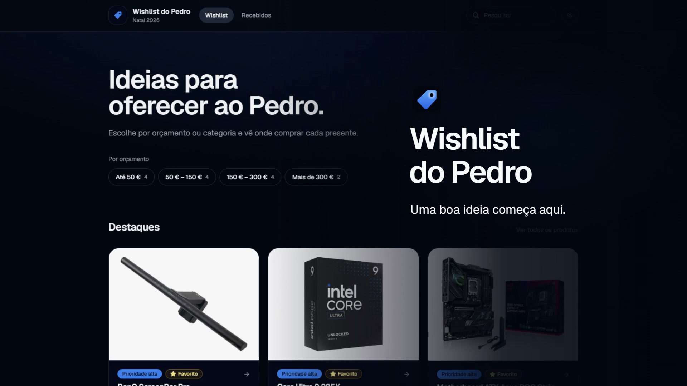

# Wishlist do Pedro

Ideias de presentes para o Pedro, organizadas para quem recebe o link e quer escolher sem
adivinhar. Explora por orçamento ou categoria, consulta os detalhes e confirma o preço na loja.

[](https://github.com/PedroMonteiro99/personal-whishlist/actions/workflows/ci.yml)


[](wishlist-do-pedro-demo.mp4)

**[Ver o vídeo de apresentação (22 s, MP4)](wishlist-do-pedro-demo.mp4)** — clica na imagem
acima para abrir o vídeo.

## Funcionalidades

- **Encontrar uma ideia:** categorias, pesquisa e filtros por orçamento, loja e prioridade, com
  estado refletido na URL para partilhar os resultados.
- **Escolher com contexto:** fotografias, notas pessoais, prioridade, preço indicativo e links
  diretos para as lojas. Quando os preços diferem, o valor mais baixo aparece como «desde».
- **Evitar presentes repetidos:** quando as reservas estão disponíveis, quem vai oferecer pode
  assinalar um presente; os nomes são visíveis a quem tem o link.
- **Acompanhar ocasiões:** presentes marcados como recebidos aparecem em **Recebidos** sem quebrar
  os links das páginas de produto.
- **Consultar em qualquer ecrã:** experiência responsiva com modos escuro e claro.

## Como funciona

O catálogo é construído a partir dos ficheiros MDX em `content/`. O Git é a fonte de verdade:

```text
ficheiros MDX em content/ → validação com Zod → build Next.js → catálogo público
```

Não há base de dados no caminho de leitura do catálogo. O Supabase serve apenas o estado opcional
das reservas; sem essa configuração, a wishlist continua a funcionar. O site não vende produtos:
os links de compra levam às lojas.

## Começar

Usa Node.js 24 (versão do CI) e pnpm 11.25.0 (versão declarada no projeto):

```bash
pnpm install
pnpm dev
```

Abre [http://localhost:3000](http://localhost:3000). Não é preciso criar `.env.local` para
consultar o catálogo localmente. Em produção, `NEXT_PUBLIC_SITE_URL` identifica o domínio usado
nos links e nas imagens de partilha.

## Conteúdo e qualidade

Um produto corresponde a um ficheiro em `content/wishlist/<categoria>/<slug>.mdx`. As categorias,
lojas e ocasiões também são versionadas em `content/`. Para acrescentar um produto e validar as
referências entre ficheiros:

```bash
pnpm new:product
pnpm validate:content
```

Verificações disponíveis:

```bash
pnpm lint
pnpm typecheck
pnpm test:run
pnpm build
pnpm test:e2e
```

O [blueprint](PROJECT_BLUEPRINT.md) é a fonte de verdade para arquitetura e decisões do projeto.
Para o contexto de produto e a linguagem visual, consulta [PRODUCT.md](PRODUCT.md) e
[DESIGN.md](DESIGN.md). As instruções para agentes estão em [CLAUDE.md](CLAUDE.md),
[GitHub Copilot](.github/copilot-instructions.md) e [`.ai/`](.ai/).
